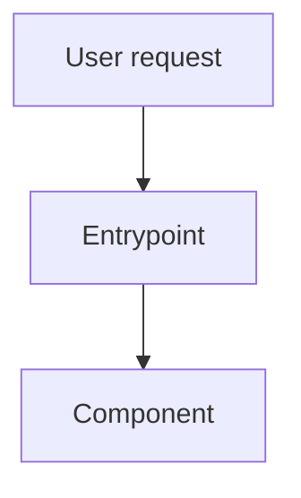

# Codebase Analysis Reports

## Overview

Use this workflow to inspect an unfamiliar codebase and produce two durable markdown artifacts:

1. **Human report** — explains architecture, purpose, important flows, evidence, and practical implications in a way a developer or decision-maker can read.
2. **AI-agent report** — a compact, explicit handoff with paths, line anchors, task-relevant facts, commands, constraints, and next-step prompts for another agent.

The core rule is **top-down, then deep**: understand repository identity and entrypoints first, map the component graph second, then drill into the files/functions relevant to the user's purpose. Do not start by randomly grepping sinks or reading leaf files unless the user supplied a very narrow target.

## When to Use

- User asks to analyze a codebase, plugin, framework, repo, module, or feature implementation.
- User wants to know how something works and where it is implemented.
- User asks for reusable knowledge for future agents.
- User asks to compare an implementation with a reference codebase.
- User has a specific analysis purpose such as security, plugin integration, model/provider routing, API surface, refactor planning, function reuse, or bug root-cause analysis.

Do **not** use this as a substitute for a full security audit, PR review, or test-driven implementation workflow. If the task is explicitly to find vulnerabilities, load and follow the appropriate security/code-review skill too.

## Inputs to Resolve First

Before deep work, resolve and write down:

- `repo_root`: absolute path or cloned repository URL.
- `analysis_goal`: user's stated purpose. If absent, use general architecture and reuse analysis.
- `analysis_scope`: whole repo, subdirectory, plugin, package, feature, diff, or file/function list.
- `output_dir`: where reports will be written. Default: repo root unless the user requested another location.
- `human_report`: default `CODEBASE_ANALYSIS_HUMAN.md`.
- `agent_report`: default `CODEBASE_ANALYSIS_AGENT.md`.

If ambiguity changes which repository or scope to inspect, ask. Otherwise choose the obvious repo/scope and proceed.

## Analysis Sequence

Follow this order. Do not skip top-down context before drilling down.

### 1. Repository Identity and Inventory

Use tools to inspect real files and commands:

- `git rev-parse --show-toplevel`, current branch, and `git status --short`.
- file tree excluding dependency/build directories.
- key manifests: `README*`, package manifests, plugin descriptors, build files, config files, `AGENTS.md` / `CLAUDE.md` / `.cursorrules` when present.
- language and size summary. Use `pygount` if available, otherwise extension/line counts are enough.

Record dirty-tree state. Do not overwrite user changes.

### 2. Entrypoints and Capabilities

Identify how the codebase is loaded or used:

- CLI commands, web/server entrypoints, package exports, plugin descriptors, skill metadata, route registries, background jobs, tests, examples.
- For plugin/skill systems, read the plugin manifest first, then skill descriptors, then referenced assets/scripts.
- For libraries, identify public modules/functions/classes and their callers.

### 3. Component Map

Group files into components and describe responsibilities:

- runtime entrypoints
- configuration/metadata
- core orchestration
- helper scripts
- references/templates/assets
- tests/fixtures/examples

Use a Mermaid diagram in the human report when useful. GitHub supports Mermaid fenced blocks:



### 4. Purpose-Specific Deep Dive

Adapt the deep dive to the user's goal:

- **General code analysis:** functions/classes, what they do, where they live, callers/reuse, important data structures.
- **Plugin analysis:** descriptor fields, skill/command registration, how metadata enables UX, how resources are referenced, expected invocation patterns.
- **Security analysis:** trust boundaries, sinks, controls, scan/report artifacts, validation rules. Only list actual risks supported by evidence.
- **Bug/root cause:** expected behavior, observed behavior, control/data flow, likely failing file/line, minimal fix surface.
- **Refactor/reuse:** stable abstractions, duplicate logic, integration seams, what to preserve vs replace.
- **Reference comparison:** inspect the user-named reference tree directly and compare file-by-file or flow-by-flow before recommending decisions.

For every key claim, include file paths and line ranges. For functions, classes, methods, commands, plugin fields, English section names, and other English identifiers, write the identifier first and then add a parenthesized explanation in the user's language. Example: `make_repo_rank_input`(저장소 파일 목록을 훑어 rank_input.csv를 만드는 함수), `capabilities`(플러그인이 읽기/쓰기/대화형 작업을 할 수 있음을 선언하는 필드). Do this especially in human-facing reports, and also in AI handoff reports when the identifier's role is not obvious.

For functions, include:

- function/class name plus parenthesized meaning/action in the user's language
- file path and line range
- responsibility
- inputs/outputs or side effects
- caller/reuse locations
- caveats if any

### 5. Limits, Uncertainty, Problems, and Risks

Separate **analysis limits** from **problems/risks**.

#### Analysis Limits / Uncertainty

If a part could not be analyzed accurately, say so explicitly instead of guessing. Include:

- what could not be determined
- why it could not be determined, with concrete blocker evidence
- what was checked before stopping
- what evidence would be needed to resolve it

Use wording like:

`이 부분은 <구체적 이유> 때문에 정확히 파악하기 어렵습니다. 확인한 범위는 <파일/명령/라인>까지이며, 정확한 판단을 위해서는 <필요한 추가 자료/실행 환경/권한>이 필요합니다.`

Common legitimate limits:

- generated files, vendored code, private packages, or external services are missing
- build/test/runtime environment cannot be reproduced within bounded effort
- plugin behavior depends on a host runtime not present locally
- dynamic behavior depends on credentials, network, database, feature flags, or deployment config
- code path is defined through reflection/metaprogramming and no call-site evidence was found
- repository is partial, dirty, or missing history needed for comparison

Do not present uncertain conclusions as facts. Use labels such as `확인됨`, `추정`, `불확실`, or `분석 불가` where helpful.

#### Evidence-Backed Problems / Risks

Only include a problem/risk section when there is concrete evidence.

- Good: `scripts/foo.py:40-58` writes to `<artifacts_dir>` while `references/bar.md:10` says `<scan_dir>`, causing path mismatch.
- Bad: generic guesses such as "could have bugs", "may be insecure", or "needs tests" without repository evidence.

If no evidence-backed problems were found, omit the problem section entirely or state briefly: `이번 분석 범위에서는 근거 있는 문제를 발견하지 못했습니다.`

### 6. Write Two Reports

#### Human Report Required Shape

Write to `CODEBASE_ANALYSIS_HUMAN.md` by default:

```markdown
# Codebase Analysis: <name>

## TL;DR
## Scope and Evidence
## Repository Map
## Architecture / Flow
```mermaid
...
```
## Key Components
## Purpose-Specific Deep Dive
## How to Use / Reuse This Code
## Evidence-Backed Problems or Risks  <!-- omit if none -->
## Analysis Limits / Uncertainty  <!-- include only if something could not be determined accurately -->
## Recommended Next Steps
```

Tone: readable first, concise second, and explanatory only as much as needed. If the user is using Korean, write human-facing headings, table headers, diagram labels, component names, summaries, and explanations in Korean. Keep exact English identifiers only where they are code/plugin names/commands/paths, and annotate important ones as `identifier`(사용자 언어 설명). Do not remove useful information merely to be short; instead compress wording, split dense paragraphs, use tables/diagrams, and avoid long explanatory prose that hurts readability.

#### AI-Agent Report Required Shape

Write to `CODEBASE_ANALYSIS_AGENT.md` by default:

```markdown
# AI Agent Handoff: <name>

## Mission Context
## Repo Facts
## Important Files and Line Anchors
## Execution / Verification Commands
## Architecture Facts
## Function/Class Index
## Constraints and Invariants
## Known Problems / Open Questions  <!-- omit if none -->
## Analysis Limits / Uncertainty  <!-- include blockers, checked scope, and needed evidence when applicable -->
## Suggested Prompts for Follow-up Agents
```

Tone: terse and operational. Prefer bullet points, exact paths, commands, and line anchors over prose. Keep exact English identifiers for copy/paste, but add parenthesized Korean/user-language explanations for important function/class/field/command names.

## Verification Checklist

Before final response:

- [ ] Inspected the actual target tree with tools.
- [ ] Recorded git status/branch and did not overwrite unrelated user changes.
- [ ] Read manifests/entrypoints before leaf files.
- [ ] Followed the user's stated analysis purpose.
- [ ] Human report exists and includes a top-down map plus deep dive.
- [ ] Agent report exists and includes paths, commands, line anchors, and constraints.
- [ ] Analysis limits are stated explicitly when exact understanding was blocked; uncertain claims are not presented as facts.
- [ ] Problem/risk claims are evidence-backed; no speculative issue list.
- [ ] Ran a lightweight validation such as checking the report files exist and include required headings.

## Common Pitfalls

1. **Bottom-up wandering.** Random search before entrypoint/manifest reading produces fragmented reports. Start at repo identity and capability registration.
2. **Inventing problems.** Do not include risk sections just because reports often have them. If no concrete issue was found, omit it.
3. **Forgetting the AI handoff.** The second report is not a summary for humans; it is an operational context pack for another agent.
4. **No line anchors.** Reports without file:line evidence are hard to reuse. Use `read_file`, searches, or small scripts to capture line ranges.
5. **Ignoring purpose.** A plugin analysis, refactor analysis, and security analysis need different deep dives even on the same repo.
6. **Overwriting user work.** If reports already exist or the tree is dirty, check whether your paths are safe and mention what you changed.
7. **Poor localization in human reports.** If the user is writing in Korean, do not leave user-facing section titles, table headers, diagram labels, or component names in English just because the source identifiers are English. Translate the surrounding report language; preserve exact code identifiers separately with short parenthesized explanations.
8. **Confusing concise with incomplete.** Readability is the first priority. Keep useful facts, but make them scan-friendly with short sentences, tables, bullets, and diagrams instead of long paragraphs.
9. **Hiding uncertainty.** If runtime behavior, generated code, external services, credentials, host plugin behavior, or missing files block accurate analysis, say exactly what is uncertain and why. Do not fill the gap with confident prose.
